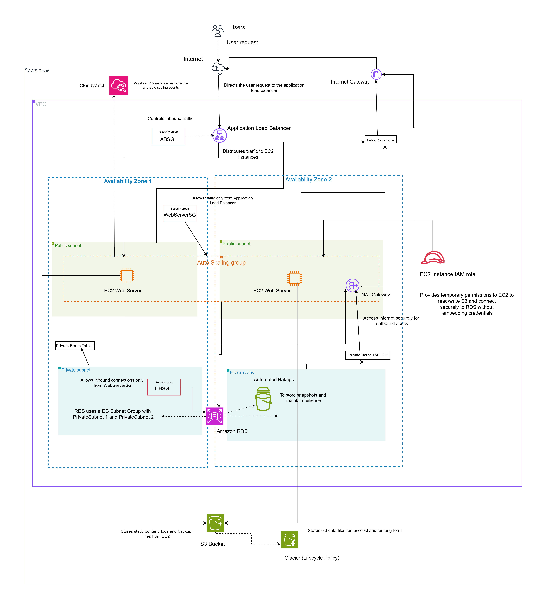
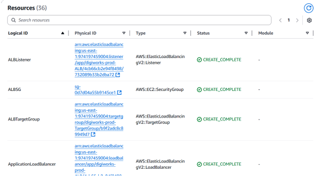
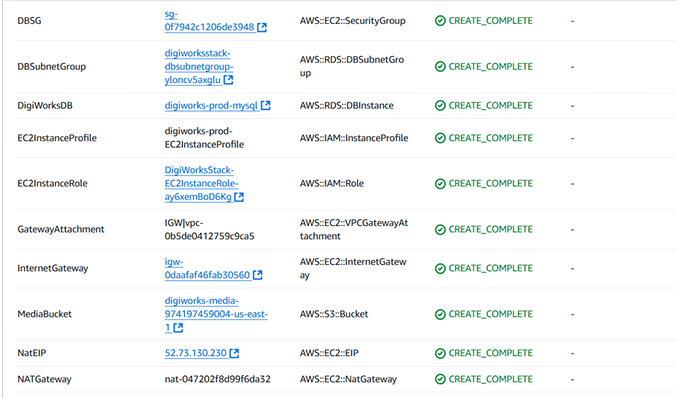
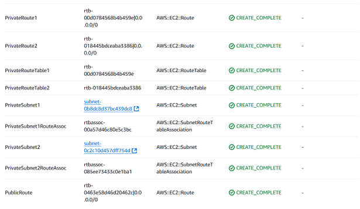
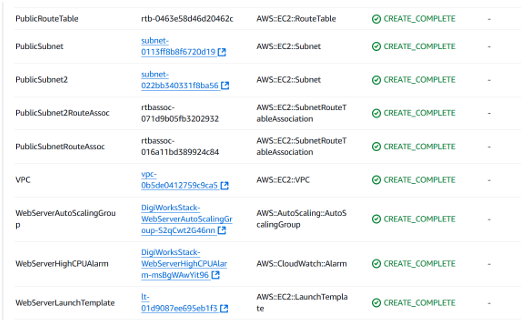
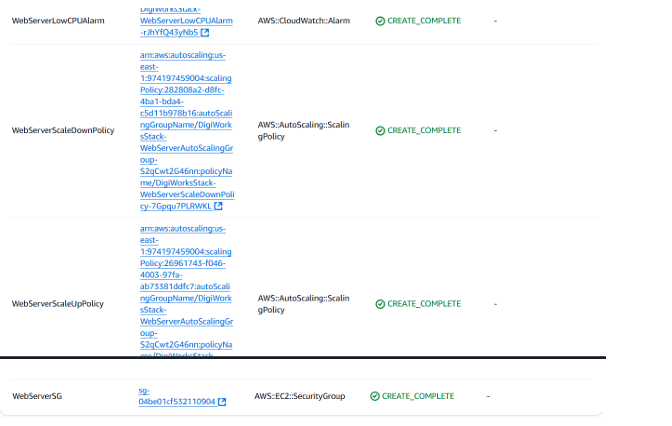
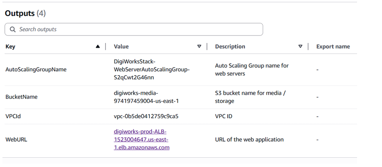

# AWS CloudFormation Infrastructure Automation

This project demonstrates Infrastructure as Code (IaC) using AWS CloudFormation to deploy a scalable and secure AWS environment for DigiWorks Studios. It includes VPC networking, EC2 Auto Scaling, an Application Load Balancer, RDS MySQL, S3 storage, IAM access controls, and CloudWatch monitoring.

## Architecture Diagram

## Key Features

* Automated AWS resource provisioning using CloudFormation.
* VPC networking with public and private subnets across two Availability Zones.
* EC2 web servers with automatic scaling and load balancing.
* Managed MySQL database with encrypted storage and automated backups.
* S3 versioning, blocked public access, and lifecycle-based storage optimisation.
* IAM roles and security groups for controlled resource access.
* CloudWatch alarms to trigger scaling actions.

## Technologies

* Amazon Web Services (AWS)
* AWS CloudFormation
* Amazon EC2 and Auto Scaling
* Application Load Balancer
* Amazon RDS for MySQL
* Amazon S3
* Amazon VPC
* AWS IAM and CloudWatch

## CloudFormation Template

The `digiworks.yaml` file defines the AWS infrastructure resources and their configuration.

## Deployment Screenshots

### Successful Stack Creation

### Resources Created

### Deployment Outputs

## Future Improvements

* Integrate CloudFront for content delivery.
* Enable Multi-AZ database deployment where required.
* Add CI/CD automation and additional deployment validation.

## Author

Sashmitha Jayaseelan
